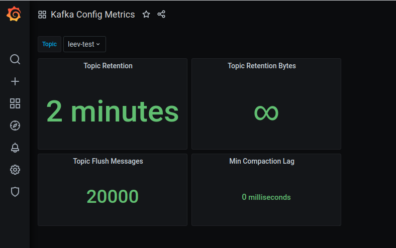

## This project is still WIP. 

# Kafka Configs Metrics Exporter


"Kafka Configs Metrics Exporter" for Prometheus allows you to export some of the Kafka configuration as metrics.

## Motivation
Unlike some other systems, Kafka doesn't expose its configurations as metrics. <br>
There are few useful configuration parameters that might be beneficial to collect in order to improve the visibility and alerting over Kafka.

A good example might be `log.retention.ms` parameter per topic, which can be integrated into Kafka's dashboards to extend it's visibilty, or to integrate it into an alerting query to create smarter alerts or automations based on a topic retention.

Having said that, I decided to create a Prometheus exporter to collect those metrics.

## Build from source

### Prerequisites

* Install Go version 1.12+

### Building Steps

1. Clone this repository
```
git clone https://github.com/EladLeev/kafka-config-metrics
cd kafka-config-metrics
```
2. Build the exporter binary
```
go build -o kcm-exporter .
```
3. Copy and edit the [config file](https://github.com/EladLeev/kafka-config-metrics/blob/master/kcm.toml) from this repository and point it into your Kafka clusters.<br>
_Use topic filtering as needed._

4. Deploy the binary and run the exporter
```
cp ~/my_kcm.toml /opt/kcm/kcm.toml
./kcm-exporter
```
The exporter will use `/opt/kcm/kcm.toml` as default.

## Using Docker Image
1. Clone this repository
```
git clone https://github.com/EladLeev/kafka-config-metrics
cd kafka-config-metrics
``` 
2. Build the Docker image
```
docker build . -t kcm-exporter
```
3. Run it with your custom configuration file
```
docker run -p 9090:9090 -v ~/my_kcm.toml:/opt/kcm/kcm.toml kcm-exporter:latest
```

## Configuration
This project tried to stand in the Prometheus community [best practices](https://prometheus.io/docs/instrumenting/writing_exporters/) -<br>
"You should aim for an exporter that requires no custom configuration by the user beyond telling it where the application is".

In fact, you don't really need to change anything beyond the `clusters` struct.

You can still change more advanced parameters if you wish.

|Stanza|Name    |Acceptable Values  |Description|Default|
|:--   |:--	    |:--	|:--	    |:--	|
|global|port    |int  	|What port to bind  |9000  	|
|log   |level   |string: info, debug, trace|Set the log level|info|
|log   |format  |string:text,json|Change log to JSON to collect using Splunk or Logstash|text|
|kafka|min_kafka_version|string:<KAFKA_VERSION>|Minimum Kafka version to use on [Sarama](https://github.com/Shopify/sarama) Go client.<br>The minimum supported client is the default.|0.11.0.0
|kafka|admin_timeout|int|The maximum duration the administrative Kafka client will wait for ClusterAdmin operations.|5 sec

### Clusters
This struct defining the clusters to pull the config from.
```
[clusters]
  
  [clusters.prod]
  brokers = ["kafka01-prod"]

  [clusters.test]
  brokers = ["kafka02-prod", "kafka03-prod"]
  topicfilter="^(qa-|test-).*$"

  # Template
  [clusters.<NAME>]
  brokers = ["<BROKER_1>", "<BROKER_2>"]
  topicfilter="<REGEX_FILTER>"
```
`topicfilter` allows you to filter topics based on a Regex.<br>
e.g - `"^(qa-|test-).*$"` - Filter all topics that are starting with `qa` or `test`.

### Prometheus Configuration
When setting this exporter in the Prometheus targets, bare in mind that topic configs are not subject to change that often in most use cases.<br>
Setting a higher `scrape_interval`, let's say to 10 minuts, will lead to lower requests rate to the Kafka cluster while still keeping the exporter functional.
```
  - job_name: 'kcm'
    scrape_interval: 600s
    static_configs:
    - targets: ['kcm-prod:8080']
```

## Dashboard Example


## Contributing

Please read [CONTRIBUTING.md](CONTRIBUTING.md) for details of submitting a pull requests.

## License

This project is licensed under the Apache License - see the [LICENSE.md](LICENSE.md) file for details.

